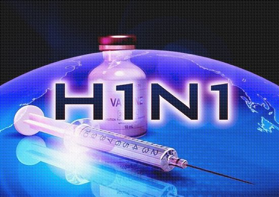
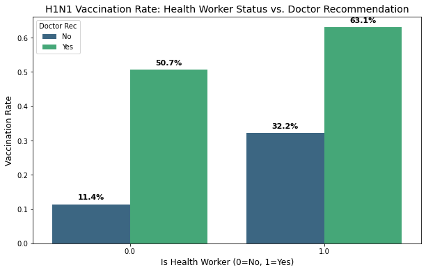
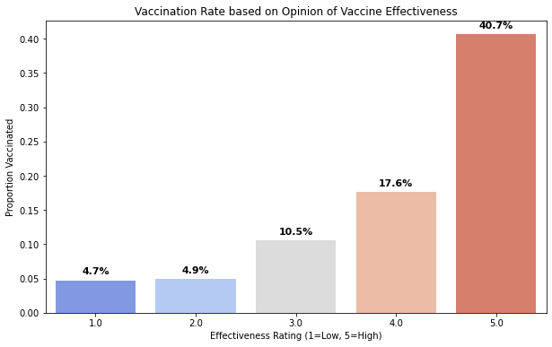

# H1N1 Vaccination Analysis: Identifying Key Drivers for Public Health

**Project by:** Valary Kones  
**Technical Stack:** Python, Scikit-Learn, Pandas, Matplotlib, NumPy

---

## Overview
<p align="center">
  
</p>
The goal of this project is to provide the **National Public Health Department** with actionable insights into the factors that influence H1N1 vaccination uptake. By building a predictive model, we identify the behavioral, clinical, and demographic drivers that can be used to design targeted public health campaigns and increase vaccination rates.

## Business Understanding
Public health officials need to understand the "why" behind vaccine hesitancy and uptake. Our objectives include:
* **Determining key features** that predict whether an individual will receive the H1N1 vaccine.
* **Comparing the impact** of professional clinical recommendations versus personal beliefs and perceived risks.
* **Providing data-driven recommendations** for resource allocation in future outreach strategies.

## Data & Methodology
The dataset is derived from the **National 2009 H1N1 Flu Survey**.
* **Target:** Binary classification (Vaccinated vs. Not Vaccinated).
* **Baseline:** Logistic Regression using `liblinear` solver.
* **Preprocessing:** Utilized `StandardScaler` within a `Pipeline` to normalize numerical features and handled categorical variables via encoding.
* **Tuning:** Performed `GridSearchCV` to optimize regularization strength ($C$) and penalty types ($L1$ vs $L2$).
* **Evaluation Metric**: ROC-AUC
ROC-AUC was selected because the H1N1 vaccination dataset is imbalanced and vaccination outreach decisions depend on ranking individuals by likelihood rather than making a single yes/no prediction. It provides a threshold-independent measure of performance that aligns with public health screening and targeting objectives.
### Dataset Class Distribution

| Vaccination Status | Percentage |
|-------------------|------------|
| Not Vaccinated (0) | 78.8% |
| Vaccinated (1) | 21.2% |

## EDA
Initially, I examined demographic factors like Age and Education, but found they only accounted for a 2-5% difference in vaccination rates. This led me to pivot my analysis toward behavioral and opinion-based features, where I found much stronger indicators and revealed several critical insights:
* **Doctor Recommendations:** We compared health worker status vs Doctor Recommendations to see the impact of Doctor's recommendation on vaccination rates. A preliminary look showed a massive gap; patients with a recommendation were significantly more likely to be vaccinated.



* **Risk Perception:** There is a direct correlation between perceived personal risk of the virus and the likelihood of seeking vaccination.Individuals who perceive their risk as "Low" (1 or 2) have a vaccination rate below 17%. Conversely, those who perceive their risk as "Very High" (5) have a vaccination rate exceeding 50%. This suggests that many people skip the vaccine not because they are "anti-vax," but because they simply don't believe the virus poses a threat to them personally.


* **Opinion on Vaccine Effectiveness:** There is a "threshold effect" regarding trust in the vaccine. Vaccination rates remain stagnant and low for anyone who rates effectiveness between 1 and 3. However, there is a massive surge in uptake once an individual’s confidence reaches a "4" or "5." Essentially, if a person isn't fully convinced the vaccine is highly effective, they are unlikely to take the "risk" or effort to get it.



## Models
We prioritized **interpretability** and **AUC-ROC** to ensure our model not only predicts accurately but also provides explainable evidence for stakeholders.
We used 4 Models:
 1. Logistic Regression (Base Model)
 2. Tuned Logistic Regression
 3. Vanilla Decision Tree
 4. Tuned Desicion Tree

### Model Performance Comparison

| Model Iteration                  | Train AUC | Test AUC | CV Mean AUC | Overfit Gap |
|----------------------------------|-----------|----------|-------------|-------------|
| **Baseline Logistic Regression** | **0.835** | **0.824** | **0.832** | 0.010 |
| **Tuned Logistic Regression** ⭐ | 0.834 | 0.824 | 0.831 | **0.010** |
| Vanilla Decision Tree (dt1)      | 0.824 | 0.807 | 0.817 | 0.017 |
| Tuned Decision Tree              | 0.823 | 0.810 | 0.817 | 0.013 |

⭐ *Best overall model based on ROC-AUC and generalization performance*


### Final Model
Our final **Tuned Logistic Regression** model significantly outperformed the baseline by optimizing the $C$ parameter and using a balanced class weight. It also had the smallest overfit
gap.
* **Key Metric:** Final Model achieved a **ROC-AUC of [Insert Score]**.
* **Feature Impact:** The model revealed that a doctor's recommendation is the strongest predictor, followed by the perceived effectiveness of the vaccine.


## Conclusion
To increase H1N1 vaccination rates, the National Public Health Department should:
* **Empower Clinicians:** Develop "Provider Prompt" programs, as a doctor's recommendation more than doubles the odds of vaccination.
* **Address Safety Fears:** Create targeted messaging to debunk the myth that the vaccine causes the flu (addressing the `opinion_seas_sick_from_vacc` factor).
* **Highlight Effectiveness:** Shift the narrative toward the vaccine’s proven efficacy to boost public confidence.

## Next Steps
* **Advanced Modeling:** Explore Random Forest or XGBoost to capture non-linear interactions between demographic features.
* **Interaction Terms:** Investigate if the impact of doctor recommendations varies significantly across different age groups or education levels.
* **Deployment:** Build a simplified risk-assessment dashboard for clinics to identify "low-probability" patients for proactive outreach.

## For More Information
See the full analysis in the [Jupyter Notebook](./Your_Notebook_Name.ipynb) or review the [Presentation](./Your_Presentation.pdf).

**Contact:** [Your Name] | [Your Email] | [Your LinkedIn]

---

## Project Structure
```text
├── README.md
├── Data/
│   ├── training_set_features.csv
│   └── training_set_labels.csv
├── Notebooks/
│   ├── Vaccination_EDA.ipynb
│   └── Vaccination_Modeling.ipynb
├── Vaccination_Presentation.pdf
└── .gitignore
